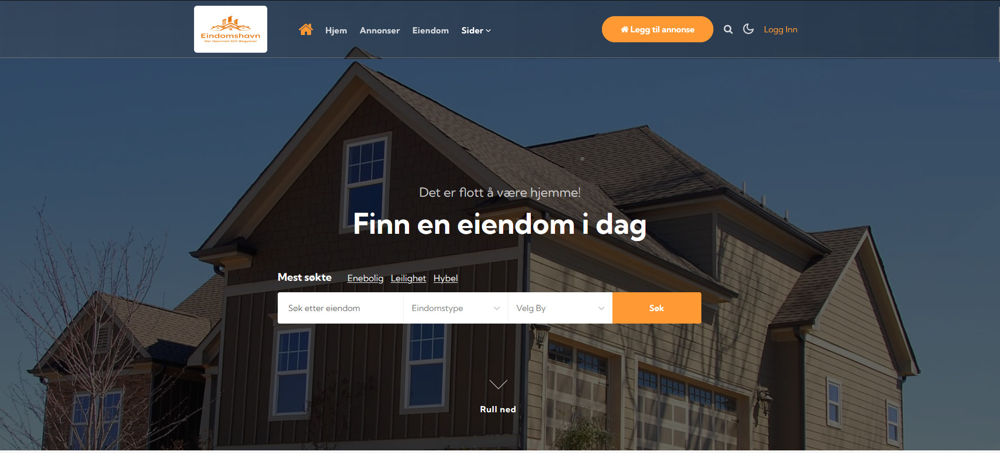

# Real Estate Management System

This project is a Real Estate Management System, which provides a platform for listing and managing properties available for rent and sale. It is built using .NET Core, ASP.NET Core MVC, Entity Framework Core for database operations, and Dapper for enhanced query performance.

## Technologies Used

This project utilizes the following technologies:

- .NET Core: The project is built on the .NET Core framework.
- ASP.NET Core MVC: It is used to create the web-based real estate platform.
- Entity Framework Core: EF Core is used as the Object-Relational Mapping (ORM) tool for database operations.
- Dapper: Dapper is used for enhanced database query performance.
- SQL Server: The application uses SQL Server as its database system.

## Why Dapper?

Dapper is chosen as the database access library for this project due to its lightweight and high-performance nature. Here are some reasons why Dapper is used:

- **Performance**: Dapper provides high performance and minimizes the overhead associated with traditional ORMs like Entity Framework.
- **SQL Control**: Dapper allows developers to write and control SQL queries directly, providing flexibility and optimization opportunities.
- **Lightweight**: It is a lightweight library that adds minimal overhead to your application.
- **Stability**: Dapper is stable and widely adopted in the .NET community.

## Features

- User Authentication: Users can sign up, log in, and manage their profiles.
- Property Listings: Users can list properties for rent or sale with details and images.
- Property Search: Visitors can search for properties based on various criteria.
- Property Details: Detailed property information including images, features, and contact details.
- Contact Agents: Users can contact property agents through the platform.
- Role-Based Access Control: Different user roles may have different permissions and access levels.
- Responsive Design: The platform is responsive and accessible on various devices.

## Installation

To set up this project locally, follow these steps:

1. Clone the project: `git clone https://github.com/yourusername/realestate.git](https://github.com/yunusy78/EiendomsHavn.git)`
2. Navigate to the project folder: `cd realestate`
3. Restore project dependencies: `dotnet restore`
4. Configure the database connection in the `appsettings.json` file.
5. Run database migrations using Entity Framework Core CLI or tools like Visual Studio.
6. Start the application: `dotnet run`
7. Open your web browser and visit `http://localhost:5000`.

## Usage

- **Registration**: Users can create accounts and manage their profiles.
- **Property Listing**: Users can list properties for rent or sale with details.
- **Property Search**: Visitors can search for properties using various filters.
- **Property Details**: Detailed property information includes images and contact details.
- **Contact Agents**: Users can contact property agents through the platform.
- **Responsive Design**: The platform is designed to work on both desktop and mobile devices.

## Database Configuration

- The project uses SQL Server as its database system.
- You can configure the database connection in the `appsettings.json` file.
- Run database migrations using Entity Framework Core CLI or tools like Visual Studio.

## API Documentation

- The project includes a RESTful API for property listing and management.
- API documentation can be found at `http://localhost:5000/swagger` when running the application locally.

## License

This project is licensed under the [License Type] license. See the [License File](LICENSE) for more details.

## Image

